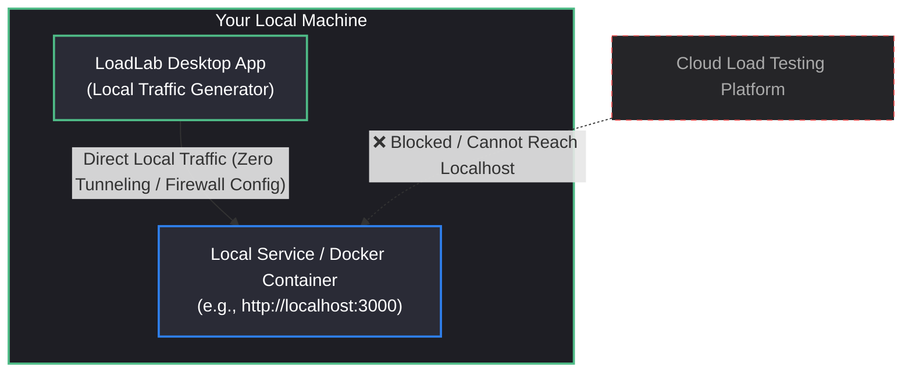
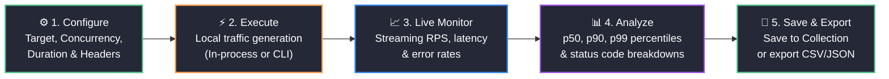
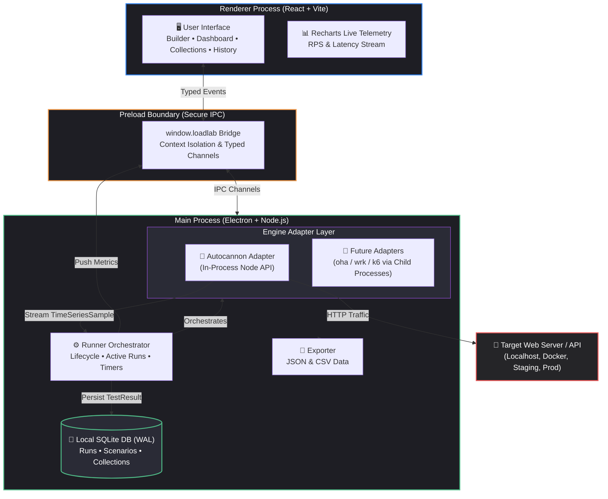
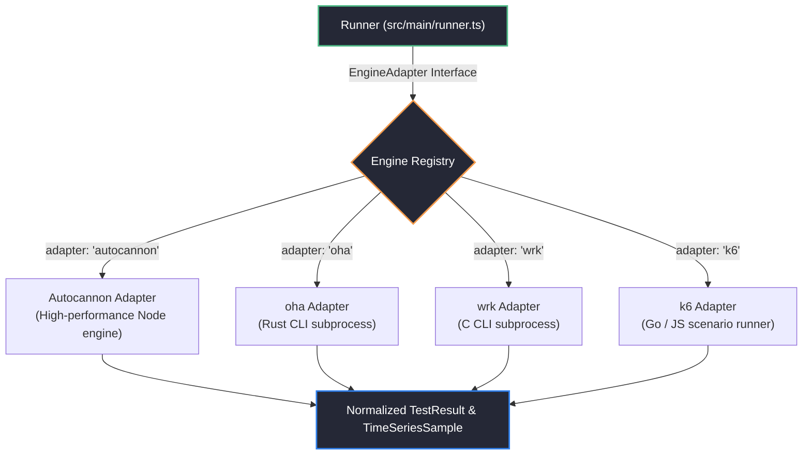

<div align="center">


# LoadLab

**Local-first HTTP load testing for developers.**

Generate high-performance load tests directly from your desktop against `localhost`, Docker containers, internal networks, or remote APIs — with zero cloud lock-in and zero remote telemetry.

[](#tech-stack)
[](#tech-stack)
[](#tech-stack)
[](#tech-stack)
[](#)

</div>

---

## 🎯 Why LoadLab?

Traditional cloud-based load testing services generate traffic from their remote servers. That introduces a major roadblock for local development: **cloud services cannot reach your private `localhost` or Docker network without opening firewalls, setting up tunnels, or deploying unfinished code to staging.**

LoadLab flips the architecture: traffic is generated directly from your local machine.



With LoadLab, you can effortlessly test:
- **`localhost` & `127.0.0.1` microservices**
- **Docker / Podman containers & Compose networks**
- **Internal VPN / LAN development environments**
- **Staging and production endpoints** (with built-in remote target authorization warnings)

---

## Key Features

- **Native Local Engine Execution**: Benchmarks execute locally with maximum throughput and minimal overhead.
- **Real-Time Interactive Dashboard**: Watch live requests/sec (RPS), latencies, and errors update in real time with Recharts.
- **Precise Latency Percentiles**: Detailed response time distributions: **Average, p50, p90, p95, and p99**.
- **Multi-Tab Workspace**: Run multiple tests, compare scenarios side-by-side, and inspect history without losing your setup.
- **Collections & Scenario Management**: Organize API tests into reusable suites and scenarios.
- **Embedded SQLite Storage**: All test configurations, runs, and time-series telemetry are stored locally in SQLite with WAL mode.
- **Import & Export**: One-click JSON collection import/export and JSON/CSV run report generation.
- **Built-in Safety Guardrails**: Proactive confirmation prompts when targeting external remote hosts or using aggressive concurrency configs.
- **Pluggable Engine Architecture**: Comes out-of-the-box with **Autocannon**, **loadtest**, **Artillery**, and native high-performance **[oha](https://github.com/hatoo/oha)** (Rust) and **[Bombardier](https://github.com/codesenberg/bombardier)** (Go) engines.

---

## 🔁 User Workflow



---

## 🏛️ Application Architecture

LoadLab follows a secure, process-isolated Electron architecture:



---

## 🔌 Pluggable Engine Architecture

Engines in LoadLab are decoupled using a unified adapter interface. The UI and database do not depend on engine-specific metrics formats.


---

## 🛠️ Tech Stack

| Layer | Technology | Description |
|---|---|---|
| **Desktop Shell** | [Electron 35](https://www.electronjs.org/) | Cross-platform desktop runtime with sandboxed IPC |
| **Frontend Framework** | [React 18](https://react.dev/) + [TypeScript](https://www.typescriptlang.org/) | Fast, component-driven UI |
| **Build Tooling** | [electron-vite](https://electron-vite.org/) + [Vite 5](https://vitejs.dev/) | Instant HMR and optimized bundler |
| **Charts & Graphs** | [Recharts](https://recharts.org/) | Real-time SVG time-series visualizer |
| **Icons** | [Lucide React](https://lucide.dev/) | Clean, consistent icons |
| **Local Database** | [Node.js SQLite (`node:sqlite`)](https://nodejs.org/api/sqlite.html) | High-speed local database running in WAL mode |
| **Default Load Engine**| [Autocannon](https://github.com/mcollina/autocannon) | Node.js HTTP/1.1 benchmarking library |

---

## 🚀 Getting Started

### Prerequisites

- [Node.js](https://nodejs.org/) (version 22+ recommended)
- `npm` (bundled with Node.js)

### Installation

Clone the repository and install dependencies:

```bash
git clone https://github.com/Darshan-A-S/LoadLab.git
cd LoadLab
npm install
```

### Development Mode

Start the app in development mode with Hot Module Replacement (HMR):

```bash
npm run dev
```

### Self-Check & Validation

Run the internal engine validation script to verify that the benchmark runner and metric streams are functioning correctly:

```bash
npm run selfcheck
```

Run TypeScript compilation check:

```bash
npm run typecheck
```

### Building for Production

Compile both the main and renderer processes:

```bash
npm run build
```

To create an installer / distributable package (e.g. Windows NSIS installer):

```bash
npm run dist
```

Artifacts will be output to the `release/` directory.

---

## 🔒 Security & Privacy

- **Zero Cloud Tracking**: All requests, targets, headers, scenarios, and test logs remain exclusively on your computer.
- **Safe Subprocess Spawning**: If using CLI-based benchmark tools, arguments are strictly parameterized arrays — preventing shell injection vulnerabilities.
- **Safety Prompts**: Confirmation dialogues warn users before sending high-frequency traffic to non-local IP addresses or domains.

---

## 📄 License

Private / All Rights Reserved.
