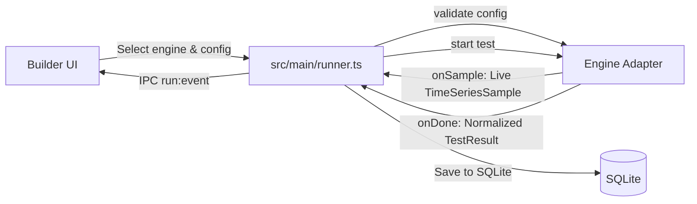

# Engine Implementation Guide

This guide explains how to implement and integrate a new benchmark/load-testing engine into **LoadLab**.

LoadLab is designed around an **engine-independent adapter architecture**. The UI and runner remain decoupled from specific benchmarking tools. All engines expose a uniform lifecycle and translate their specific metrics into normalized data structures.

---

## 1. High-Level Architecture

Every load engine adheres to the following flow:



### Lifecycle Contract
1. **Validation**: Check if the requested parameters (e.g. connections, duration, pipelining, headers, rate caps) are supported by the engine.
2. **Start**: Initialize and trigger the benchmark run.
3. **Stream Metrics (`onSample`)**: Emit periodic samples (every 1–2 seconds) for live charting.
4. **Completion (`onDone`)**: Deliver a normalized [`TestResult`](file:///C:/Users/asdar/Desktop/LoadLab/src/shared/types.ts#L45) with latency percentiles, status codes, and throughput.
5. **Stop**: Abort an ongoing test gracefully or terminate any spawned child processes.

---

## 2. Core Data Contracts

All types reside in [`src/shared/types.ts`](file:///C:/Users/asdar/Desktop/LoadLab/src/shared/types.ts).

### Time Series Sample (`TimeSeriesSample`)
Emitted periodically via `cb.onSample(...)` during a run:

```typescript
export interface TimeSeriesSample {
  /** Elapsed seconds since test start */
  t: number
  /** Current requests per second */
  rps: number
  /** Median/average latency in milliseconds */
  latency: number
  /** Error count in the current sample window */
  errors: number
  /** Throughput in bytes per second */
  throughput: number
  /** Cumulative total requests sent so far */
  totalRequests: number
  /** Cumulative total errors encountered so far */
  totalErrors: number
}
```

### Final Result (`TestResult`)
Emitted upon completion via `cb.onDone(null, result)`:

```typescript
export interface TestResult {
  runId: number
  engine: string
  startedAt: string      // ISO 8601 string
  finishedAt: string     // ISO 8601 string
  durationSec: number
  requests: number       // Total requests sent
  requestsPerSecond: number
  throughput: number     // Average bytes/sec
  latency: {
    average: number
    p50: number
    p90: number
    p95: number
    p99: number
  }
  errors: number         // Non-2xx HTTP responses + socket/network errors
  timeouts: number
  statusCodes: Record<string, number> // e.g. { "200": 15000, "500": 3 }
  timeSeries: TimeSeriesSample[]
}
```

---

## 3. Step-by-Step Implementation

### Step 1: Register the Engine Type

Edit [`src/shared/types.ts`](file:///C:/Users/asdar/Desktop/LoadLab/src/shared/types.ts):

```typescript
// 1. Define supported engine IDs
export type EngineType = 'autocannon' | 'oha' | 'k6' | 'myengine'

export interface TestDefinition {
  name: string
  target: {
    url: string
    method: HttpMethod
    headers?: Record<string, string>
    body?: string
  }
  load: {
    connections: number
    durationSeconds: number
    pipelining: number
    rate?: number
  }
  // 2. Change from 'autocannon' to EngineType
  engine: EngineType
}
```

---

### Step 2: Implement the Adapter

Create `src/main/engine/<engine-name>.ts`. Depending on your engine, use one of the two standard patterns below.

#### Pattern A: Node Library / In-Process Engine
Use this pattern if the engine is an npm library (like Autocannon, Undici, or an HTTP worker pool).

```typescript
import type { TestDefinition, TestResult, TimeSeriesSample } from '../../shared/types'

export interface EngineStartCallbacks {
  onSample: (sample: TimeSeriesSample) => void
  onDone: (err: Error | null, result: TestResult) => void
}

interface ActiveRun {
  stop: () => void
}

const activeRuns = new Map<number, ActiveRun>()

export function validate(config: TestDefinition): string[] {
  const errors: string[] = []
  if (config.load.connections > 10000) {
    errors.push('MyEngine supports at most 10000 connections')
  }
  return errors
}

export function isRunning(runId: number): boolean {
  return activeRuns.has(runId)
}

export function start(config: TestDefinition, runId: number, cb: EngineStartCallbacks): void {
  const startedAt = Date.now()
  const samples: TimeSeriesSample[] = []

  // Set up periodic ticker for live metrics
  const timer = setInterval(() => {
    const sample: TimeSeriesSample = {
      t: Math.round((Date.now() - startedAt) / 1000),
      rps: 0,
      latency: 0,
      errors: 0,
      throughput: 0,
      totalRequests: 0,
      totalErrors: 0
    }
    samples.push(sample)
    cb.onSample(sample)
  }, 1000)

  activeRuns.set(runId, {
    stop: () => {
      clearInterval(timer)
      // trigger internal cancellation
    }
  })

  // When completed:
  // clearInterval(timer)
  // activeRuns.delete(runId)
  // cb.onDone(null, testResult)
}

export function stop(runId: number): void {
  const run = activeRuns.get(runId)
  if (run) {
    run.stop()
    activeRuns.delete(runId)
  }
}
```

---

#### Pattern B: External CLI Subprocess (e.g. `oha`, `wrk`, `k6`)
Use this pattern when invoking a native executable.

> [!IMPORTANT]
> **Process Security**: Never build command strings with string concatenation or pass `shell: true`. Always pass arguments as an array (`string[]`) to prevent command injection.

```typescript
import { spawn, ChildProcess } from 'node:child_process'
import type { TestDefinition, TestResult, TimeSeriesSample } from '../../shared/types'

export interface EngineStartCallbacks {
  onSample: (sample: TimeSeriesSample) => void
  onDone: (err: Error | null, result: TestResult) => void
}

const activeProcesses = new Map<number, ChildProcess>()

export function validate(config: TestDefinition): string[] {
  const errors: string[] = []
  // Check engine-specific limitations
  return errors
}

export function isRunning(runId: number): boolean {
  return activeProcesses.has(runId)
}

export function start(config: TestDefinition, runId: number, cb: EngineStartCallbacks): void {
  const startedAt = Date.now()

  // 1. Build CLI arguments
  const args = [
    '-z', `${config.load.durationSeconds}s`,
    '-c', `${config.load.connections}`,
    '--json',
    config.target.url
  ]

  // Add headers if present
  if (config.target.headers) {
    for (const [k, v] of Object.entries(config.target.headers)) {
      args.push('-H', `${k}: ${v}`)
    }
  }

  // 2. Spawn process
  const child = spawn('oha', args, { stdio: ['ignore', 'pipe', 'pipe'] })
  activeProcesses.set(runId, child)

  let stdout = ''
  let stderr = ''

  child.stdout?.on('data', (chunk) => { stdout += chunk.toString() })
  child.stderr?.on('data', (chunk) => { stderr += chunk.toString() })

  // 3. Periodic sample simulator (if CLI only produces output at the end)
  const interval = setInterval(() => {
    cb.onSample({
      t: Math.round((Date.now() - startedAt) / 1000),
      rps: 0,
      latency: 0,
      errors: 0,
      throughput: 0,
      totalRequests: 0,
      totalErrors: 0
    })
  }, 1000)

  // 4. Handle exit
  child.on('close', (code) => {
    clearInterval(interval)
    activeProcesses.delete(runId)

    if (code !== 0 && code !== null) {
      cb.onDone(new Error(stderr.trim() || `Process exited with code ${code}`), null as unknown as TestResult)
      return
    }

    try {
      const raw = JSON.parse(stdout)
      // Normalize raw CLI JSON output to LoadLab's TestResult structure
      const result: TestResult = {
        runId,
        engine: 'oha',
        startedAt: new Date(startedAt).toISOString(),
        finishedAt: new Date().toISOString(),
        durationSec: config.load.durationSeconds,
        requests: raw.summary?.totalRequests ?? 0,
        requestsPerSecond: Math.round(raw.summary?.requestsPerSec ?? 0),
        throughput: raw.summary?.bytesPerSec ?? 0,
        latency: {
          average: Math.round((raw.latency?.average ?? 0) * 1000),
          p50: Math.round((raw.latency?.p50 ?? 0) * 1000),
          p90: Math.round((raw.latency?.p90 ?? 0) * 1000),
          p95: Math.round((raw.latency?.p95 ?? 0) * 1000),
          p99: Math.round((raw.latency?.p99 ?? 0) * 1000)
        },
        errors: raw.summary?.failureCount ?? 0,
        timeouts: raw.summary?.timeoutCount ?? 0,
        statusCodes: raw.statusCodeDistribution ?? {},
        timeSeries: []
      }
      cb.onDone(null, result)
    } catch (parseErr) {
      cb.onDone(new Error(`Failed to parse engine output: ${parseErr}`), null as unknown as TestResult)
    }
  })

  child.on('error', (err) => {
    clearInterval(interval)
    activeProcesses.delete(runId)
    cb.onDone(err, null as unknown as TestResult)
  })
}

export function stop(runId: number): void {
  const child = activeProcesses.get(runId)
  if (!child) return

  // On Windows, child.kill() may not terminate child processes spawned by a wrapper.
  // Use SIGTERM or SIGKILL:
  if (process.platform === 'win32' && child.pid) {
    spawn('taskkill', ['/pid', child.pid.toString(), '/T', '/F'])
  } else {
    child.kill('SIGTERM')
  }
  activeProcesses.delete(runId)
}
```

---

### Step 3: Wire into Runner Dispatcher

In [`src/main/runner.ts`](file:///C:/Users/asdar/Desktop/LoadLab/src/main/runner.ts), dispatch calls to the selected engine:

```typescript
import * as autocannon from './engine/autocannon'
import * as oha from './engine/oha'
import type { TestDefinition, EngineType } from '../shared/types'

interface EngineAdapter {
  validate(config: TestDefinition): string[]
  start(config: TestDefinition, runId: number, cb: any): void
  stop(runId: number): void
  isRunning?(runId: number): boolean
}

const ENGINES: Record<EngineType, EngineAdapter> = {
  autocannon,
  oha
}

function getEngine(type: EngineType): EngineAdapter {
  const engine = ENGINES[type]
  if (!engine) throw new Error(`Unsupported engine: "${type}"`)
  return engine
}
```

Replace hardcoded `autocannon` calls:
- In `startTest()`:
  ```typescript
  const engine = getEngine(def.engine)
  const engineErrors = engine.validate(def)
  if (engineErrors.length) throw new Error(engineErrors.join('; '))
  ...
  engine.start(def, runId, { ... })
  ```
- In `stopTest()`:
  Track the active `engine` for each `runId` or call `stop(runId)` across registered engines.

---

### Step 4: Expose in Builder UI

Open [`src/renderer/src/components/Builder.tsx`](file:///C:/Users/asdar/Desktop/LoadLab/src/renderer/src/components/Builder.tsx). Locate the Engine card (around line 214) and enable selection:

```tsx
<div className="card">
  <h2>Engine</h2>
  <label className="field" style={{ maxWidth: 220 }}>
    Engine
    <select
      value={draft.engine}
      onChange={(e) => set({ engine: e.target.value as EngineType })}
    >
      <option value="autocannon">Autocannon (Default)</option>
      <option value="oha">oha</option>
    </select>
  </label>
</div>
```

---

## 4. Testing Your Engine

You can create a standalone test script under `scripts/` following the pattern in [`scripts/selfcheck.mjs`](file:///C:/Users/asdar/Desktop/LoadLab/scripts/selfcheck.mjs):

```javascript
import http from 'node:http'
import assert from 'node:assert/strict'
import { once } from 'node:events'
import { start } from '../src/main/engine/oha.ts'

// 1. Spin up a test HTTP server
const server = http.createServer((req, res) => {
  res.writeHead(200, { 'content-type': 'text/plain' })
  res.end('ok')
})
server.listen(0, '127.0.0.1')
await once(server, 'listening')

// 2. Run engine against it
const result = await new Promise((resolve, reject) => {
  start({
    name: 'test',
    target: { url: `http://127.0.0.1:${server.address().port}/`, method: 'GET' },
    load: { connections: 2, durationSeconds: 2, pipelining: 1 },
    engine: 'oha'
  }, 1, {
    onSample: () => {},
    onDone: (err, res) => err ? reject(err) : resolve(res)
  })
})

// 3. Verify assertions
assert.ok(result.requests > 0)
assert.ok(result.latency.p50 > 0)
server.close()
console.log('Engine test PASSED!')
```

Run TypeScript verification:
```bash
npm run typecheck
```

---

## 5. Checklist for Adding an Engine

- [ ] Add engine key to `EngineType` in [`src/shared/types.ts`](file:///C:/Users/asdar/Desktop/LoadLab/src/shared/types.ts)
- [ ] Create `src/main/engine/<name>.ts` exporting `validate`, `start`, `stop`
- [ ] Handle periodic `onSample` emissions with valid `TimeSeriesSample` fields
- [ ] Format non-2xx status codes into `errors` and populate `statusCodes` map
- [ ] Register in [`src/main/runner.ts`](file:///C:/Users/asdar/Desktop/LoadLab/src/main/runner.ts)
- [ ] Enable dropdown selection in [`src/renderer/src/components/Builder.tsx`](file:///C:/Users/asdar/Desktop/LoadLab/src/renderer/src/components/Builder.tsx)
- [ ] Ensure `stop(runId)` cleans up intervals or terminates child processes
- [ ] Run `npm run typecheck` to verify all types pass
