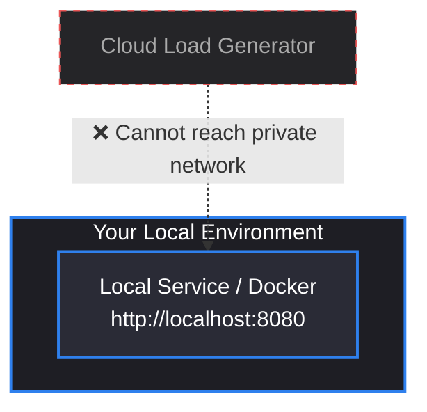
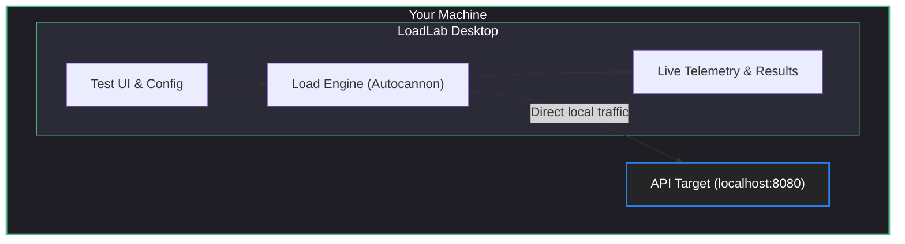
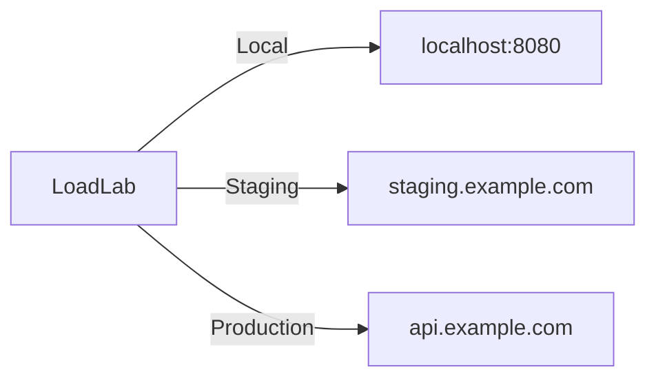
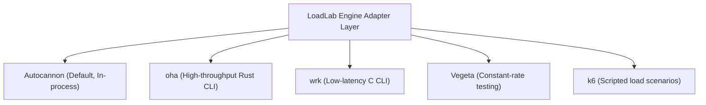
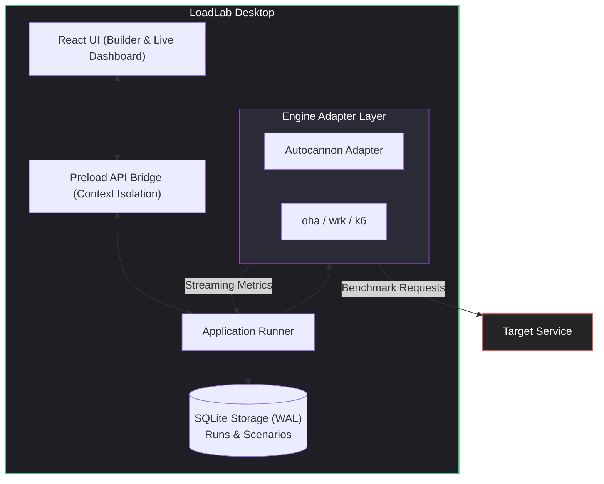
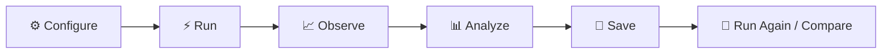

# LoadLab

> Local-first load testing for developers.

LoadLab is a desktop application for configuring and running HTTP load tests directly from your own machine.

Instead of sending your target URL to a remote load-generation server, LoadLab generates the traffic locally.

That means you can test:

- `localhost`
- `127.0.0.1`
- Docker / Podman containers
- LAN / internal VPN services
- Staging APIs
- Deployed APIs & production endpoints you are authorized to test

## Why LoadLab?

Traditional hosted load-testing platforms require the load generator to reach your target from their infrastructure.

That creates a fundamental obstacle for local development:

LoadLab changes the model by placing the generator directly on your machine:

The same application can then test deployed environments without changing workflows:

## Core Idea: Engine Orchestration

LoadLab is an orchestration and visualization layer around proven load-testing engines.

The engines perform the actual load generation. LoadLab provides a unified developer experience, live dashboards, and SQLite-backed reporting.

## Features

### Current
- Windows desktop application (Electron 35 + React 18 + TypeScript)
- No mandatory account or telemetry
- Local-first traffic generation
- HTTP/1.1 load testing via Autocannon adapter
- Multi-tab test builder with headers, method, body, connections, pipelining, duration, and rate capping
- Live Recharts dashboard (streaming RPS, latency, and errors)
- Statistical latency percentiles (Average, p50, p90, p95, p99)
- Detailed status code distribution tracking
- Scenarios & Collections management
- Local SQLite database with WAL mode for history and runs
- JSON collection import/export and JSON/CSV run report export

### Planned / Extensible
- Additional engine adapters (`oha`, `wrk`, `k6`, `vegeta`)
- Side-by-side run comparison
- HTML report generation
- gRPC load testing (via `ghz`)
- Browser-level synthetic testing
- Distributed load generation agents

---

## Architecture

---

## Technology Stack

- **Desktop Shell**: Electron 35
- **Frontend**: React 18, TypeScript, Recharts, Lucide React
- **Build System**: electron-vite, Vite 5
- **Storage**: Native Node.js SQLite (`node:sqlite`)
- **Default Engine**: Autocannon

---

## Development Lifecycle

---

## Safety & Ethics

- Only test systems that you own or are explicitly authorized to test.
- Load testing consumes real CPU, bandwidth, and server capacity.
- LoadLab provides confirmation prompts when targeting remote hosts and high-concurrency configurations.
